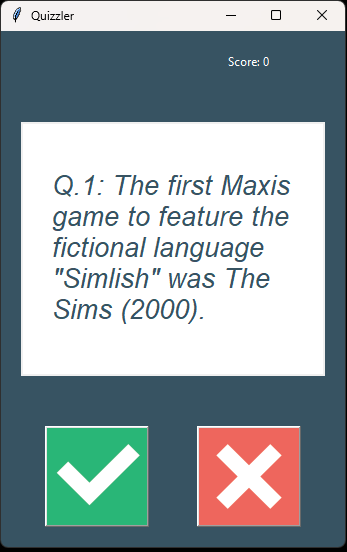
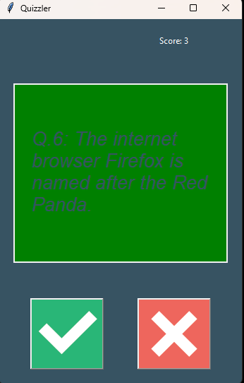
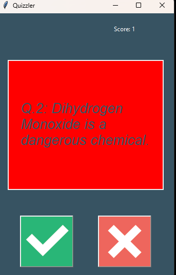
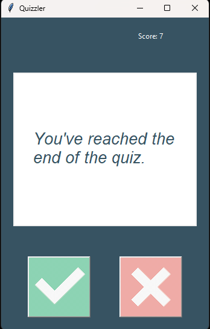

# Quizzler - A True/False Quizzing Game

## Overview

**Quizzler** is a graphical user interface (GUI) application that presents a 10-question true/false quiz on random topics. It uses the [Open Trivia Database](https://opentdb.com/) to fetch trivia questions and offers an engaging way to test your knowledge.

## Features

- Fetches random true/false questions from Open Trivia Database.
- Keeps track of the user's score in real time.
- Provides immediate feedback on answers with a visually appealing interface.
- Displays a final score and message at the end of the quiz.

## Screenshots
### Question Screen


### Right Answer Screen


### Wrong Answer Screen


### End Screen


## Purpose

The purpose of this application is to create a fun and interactive learning experience using Python's Tkinter library for GUI development.

## Tools and Technologies

- **Python 3.9+**
- **Tkinter** for GUI development
- **Open Trivia Database API** for fetching quiz questions

## Installation

1. Clone the repository:
   ```bash
   git clone https://github.com/your-username/quizzler.git
   ```
2. Navigate to the project directory:
   ```bash
   cd quizzler
   ```
3. Install dependencies (if any):
   ```bash
   pip install requests
   ```
4. Ensure the `images` directory contains the `true.png` and `false.png` images for the buttons.

## How to Run

1. Run the `main.py` file:
   ```bash
   python main.py
   ```
2. The GUI will open, and you can start answering questions by clicking the **True** or **False** buttons.

## GUI Layout

### Main Screen (Quiz Screen)
- **Question Area**: Displays the current question in a text canvas.
- **Score Label**: Shows the user's current score.
- **Buttons**: 
  - True Button: For selecting "True" as your answer.
  - False Button: For selecting "False" as your answer.

### End Screen (After Quiz Completion)
- A message is displayed: "You've reached the end of the quiz."
- Buttons are disabled to indicate the quiz has ended.

## Contributing

Contributions are welcome! Feel free to fork the repository and submit pull requests for improvements.

## License

This project is licensed under the MIT License.

---

Enjoy testing your knowledge with **Quizzler**!
